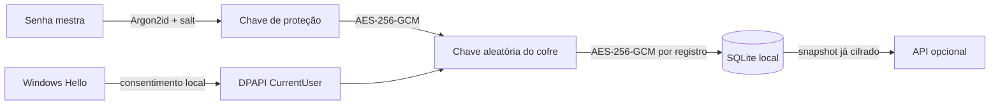

<p align="center">
  
</p>

# ScanFace

[](https://github.com/CrashBrazil/ScanFace/actions/workflows/ci.yml)
[](https://github.com/CrashBrazil/ScanFace/releases/latest)
[](LICENSE)

Gerenciador de senhas para Windows, offline first e zero knowledge, com desbloqueio local pelo Windows Hello. Depois da configuração inicial, o usuário pode entrar com reconhecimento facial sem digitar ou conhecer a senha mestra, desde que o Windows Hello continue disponível naquele perfil e dispositivo.

## Baixar

Baixe o `ScanFace.exe` na [versão mais recente](https://github.com/CrashBrazil/ScanFace/releases/latest). O executável x64 é autocontido: não exige instalar o .NET separadamente.

Requisitos: Windows 10 versão 2004 ou posterior, ou Windows 11, em arquitetura x64. Para entrar com o rosto, configure antes o reconhecimento facial no Windows Hello. O Windows pode apresentar impressão digital ou PIN como alternativa, conforme as políticas do computador.

## Recursos

- Cofre local com cada credencial cifrada por AES-256-GCM.
- Chave aleatória de 256 bits, protegida por uma chave derivada da senha mestra com Argon2id.
- Segundo envelope local da chave protegido por DPAPI e liberado pelo fluxo do Windows Hello.
- Cadastro, edição, exclusão, favoritos e pesquisa de credenciais.
- Gerador criptograficamente seguro de senhas.
- Área de transferência limpa automaticamente após 30 segundos.
- Bloqueio automático após 5 minutos de inatividade.
- Troca da senha mestra após desbloqueio, inclusive quando a entrada foi feita pelo rosto.
- Exportação e restauração de backup cifrado (`.scanface`).
- Sincronização opcional com controle de conflito; a API armazena apenas o snapshot cifrado.

## Como a proteção funciona



A senha mestra, a chave do cofre e os dados biométricos nunca são enviados à API. O envelope ligado ao Windows Hello é específico do perfil do Windows e fica fora de backups e sincronizações. Consulte [Arquitetura](docs/ARCHITECTURE.md) e [Modelo de ameaça](docs/THREAT_MODEL.md) para os detalhes e limites.

## Executar a partir do código

Pré-requisitos: Windows 10/11 e [.NET 10 SDK](https://dotnet.microsoft.com/download/dotnet/10.0).

```powershell
dotnet restore ScanFace.slnx
dotnet build ScanFace.slnx --configuration Release
dotnet test ScanFace.slnx --configuration Release
dotnet run --project src/ScanFace.App/ScanFace.App.csproj
```

Os dados ficam em `%LOCALAPPDATA%\ScanFace`. Nenhuma informação é gravada no diretório do executável.

## Gerar o EXE

```powershell
dotnet publish src/ScanFace.App/ScanFace.App.csproj `
  --configuration Release `
  --runtime win-x64 `
  --self-contained true `
  --output artifacts/ScanFace-win-x64
```

O resultado principal é `artifacts/ScanFace-win-x64/ScanFace.exe`. Tags no formato `v*` acionam o workflow que cria uma release com EXE, ZIP portátil e SHA-256.

## API de sincronização opcional

```powershell
$env:SCANFACE_SYNC_TOKEN = "troque-por-um-token-longo-e-aleatorio"
docker compose up --build -d
```

No aplicativo, abra **Configurações**, informe `http://localhost:8080` e o mesmo token, salve e clique em **Sincronizar**. Em produção, use HTTPS e um token exclusivo. A referência completa está em [API de sincronização](docs/SYNC_API.md).

## Estrutura

```text
src/
├── ScanFace.Domain          Entidades e modelos puros
├── ScanFace.Application     Casos de uso e contratos
├── ScanFace.Infrastructure  AES-GCM, Argon2id, DPAPI, Hello, SQLite e HTTP
├── ScanFace.App             WPF e MVVM
└── ScanFace.SyncApi         API ASP.NET Core para blobs cifrados
tests/
└── ScanFace.Tests           Criptografia, cofre e concorrência da API
```

O projeto usa uma Clean Architecture simplificada: as dependências apontam para o domínio, enquanto WPF, Windows Hello e persistência permanecem nas bordas.

## Documentação

- [Arquitetura e decisões técnicas](docs/ARCHITECTURE.md)
- [Modelo de ameaça e limitações](docs/THREAT_MODEL.md)
- [API de sincronização](docs/SYNC_API.md)
- [Roteiro de avaliação acadêmica](docs/ACADEMIC_EVALUATION.md)
- [Política de segurança](SECURITY.md)
- [Como contribuir](CONTRIBUTING.md)

## Licença

Distribuído sob a [GNU General Public License v3.0](LICENSE).
