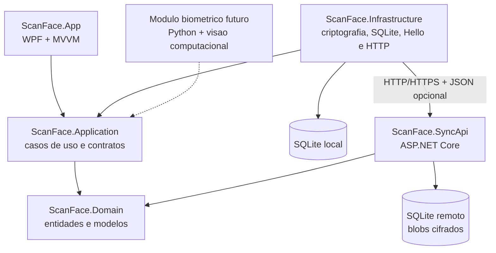
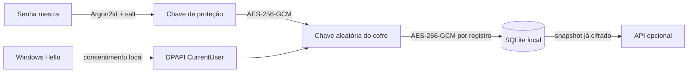

<p align="center">
  
</p>

# ScanFace

[](https://github.com/CrashBrazil/ScanFace/actions/workflows/ci.yml)
[](https://github.com/CrashBrazil/ScanFace/releases/latest)
[](LICENSE)

Gerenciador de senhas para Windows, offline first e zero knowledge, com desbloqueio local pelo Windows Hello. Depois da configuração inicial, o usuário pode entrar com reconhecimento facial sem digitar ou conhecer a senha mestra, desde que o Windows Hello continue disponível naquele perfil e dispositivo.

## Visão do projeto

**Problema:** senhas reutilizadas, fracas ou armazenadas sem proteção aumentam o risco de acesso indevido às contas dos usuários.

**Solução:** um cofre de senhas nativo para Windows que mantém as credenciais cifradas no dispositivo e oferece desbloqueio pela senha mestra ou pelo Windows Hello. A sincronização é opcional e transfere somente dados previamente cifrados pelo cliente.

**Objetivo:** oferecer uma forma simples, segura e prática de cadastrar, pesquisar, gerar, copiar, exportar e sincronizar credenciais sem entregar ao servidor as chaves ou os dados em texto puro.

**Público-alvo:** usuários de Windows que precisam organizar credenciais e valorizam funcionamento local, facilidade de uso e proteção dos dados.

> **Estado atual e evolução:** atualmente, a verificação biométrica é realizada pelo Windows Hello e o aplicativo recebe apenas o resultado da confirmação do sistema operacional. Uma implementação própria de visão computacional, com Python, detecção facial, embeddings e mecanismos anti-spoofing, está planejada para uma etapa futura.

## Ideação e prototipação

O processo inicial foi documentado de acordo com etapas de Design Thinking:

| Etapa | Resultado |
|---|---|
| Identificação do problema | Necessidade de reduzir o armazenamento inseguro e a reutilização de senhas. |
| Definição | Criar um gerenciador Windows offline first, com criptografia local e uso simples. |
| Ideação | Combinar senha mestra, cofre cifrado, Windows Hello, backup e sincronização opcional. |
| Prototipação | Construir o fluxo funcional em WPF: configuração, desbloqueio, cofre, edição de credenciais, backup e configurações. |
| Validação | Executar testes automatizados de criptografia, persistência, interface e conflitos de sincronização. |

## Baixar

Escolha um dos arquivos da [versão mais recente](https://github.com/CrashBrazil/ScanFace/releases/latest):

| Arquivo | Uso |
|---|---|
| [`ScanFace-Setup.exe`](https://github.com/CrashBrazil/ScanFace/releases/latest/download/ScanFace-Setup.exe) | Recomendado. Instala no perfil do usuário, cria atalhos e inclui desinstalador. |
| [`ScanFace.exe`](https://github.com/CrashBrazil/ScanFace/releases/latest/download/ScanFace.exe) | Versão portátil em um único arquivo. Pode ser executada diretamente. |
| `ScanFace-win-x64.zip` | Pacote portátil completo para extração manual. |

As duas versões são autocontidas e não exigem instalar o .NET separadamente. O cofre fica em `%LOCALAPPDATA%\ScanFace`, separado do programa, e é preservado durante atualizações ou desinstalações. Consulte o [guia de instalação e portabilidade](docs/INSTALLATION.md).

Requisitos: Windows 10 versão 2004 ou posterior, ou Windows 11, em arquitetura x64. Para entrar com o rosto, configure antes o reconhecimento facial no Windows Hello. O Windows pode apresentar impressão digital ou PIN como alternativa, conforme as políticas do computador.

## Recursos

- Cofre local com cada credencial cifrada por AES-256-GCM.
- Chave aleatória de 256 bits, protegida por uma chave derivada da senha mestra com Argon2id.
- Segundo envelope local da chave protegido por DPAPI e liberado pelo fluxo do Windows Hello.
- Cadastro, edição, exclusão, favoritos e pesquisa de credenciais.
- Pastas cifradas para organizar e filtrar credenciais.
- Gerador criptograficamente seguro com comprimento, grupos, mínimos e exclusão de caracteres ambíguos configuráveis.
- Área de transferência limpa automaticamente após 30 segundos.
- Bloqueio automático após 5 minutos de inatividade.
- Troca da senha mestra após desbloqueio, inclusive quando a entrada foi feita pelo rosto.
- Exportação e restauração de backup cifrado (`.scanface`).
- Sincronização opcional com controle de conflito; a API armazena apenas o snapshot cifrado.

## Tecnologias utilizadas

| Tecnologia | Motivo do uso |
|---|---|
| C# | Linguagem moderna, segura e integrada ao ecossistema Windows. |
| .NET 10 | Plataforma de alto desempenho para o aplicativo desktop e a API. |
| WPF e XAML | Criação de uma interface desktop nativa para Windows. |
| Python e bibliotecas de visão computacional (planejado) | Implementação futura de detecção, reconhecimento facial e verificação de vivacidade. |
| MVVM e Clean Architecture | Separação entre interface, regras de negócio, domínio e infraestrutura, facilitando testes e manutenção. |
| SQLite | Banco local leve, rápido e sem necessidade de um servidor separado. |
| ASP.NET Core | Implementação simples e eficiente da API opcional de sincronização. |
| HTTP e JSON | Comunicação padronizada entre o aplicativo e a API. |
| AES-256-GCM | Cifragem das credenciais com confidencialidade e verificação de integridade. |
| Argon2id | Derivação da chave da senha mestra com resistência a ataques de força bruta. |
| Windows Hello e DPAPI | Desbloqueio local e proteção de segredos vinculados ao perfil do Windows. |
| xUnit e Coverlet | Testes automatizados e medição de cobertura de código. |
| Docker | Execução e implantação isolada da API de sincronização. |
| GitHub Actions | Automação de compilação, testes, empacotamento e releases. |

## Arquitetura do sistema

O projeto aplica uma Clean Architecture simplificada. O domínio não depende de interface, banco de dados ou serviços externos; essas implementações ficam nas camadas externas.



| Projeto | Responsabilidade |
|---|---|
| `ScanFace.Domain` | Entidades, modelos criptográficos e modelos de sincronização. |
| `ScanFace.Application` | Casos de uso, contratos, sessão, backup e coordenação da sincronização. |
| `ScanFace.Infrastructure` | SQLite, AES-GCM, Argon2id, DPAPI, Windows Hello, arquivos e HTTP. |
| `ScanFace.App` | Views WPF, ViewModels, comandos e composição da aplicação. |
| `ScanFace.SyncApi` | API autenticada que armazena somente snapshots cifrados. |

O fluxo principal é `Interface -> Aplicação -> Domínio`. A camada de infraestrutura implementa os contratos definidos pela aplicação. Dessa forma, regras de negócio não contêm SQL, código de interface ou chamadas HTTP.

### Evolução biométrica planejada

O Windows Hello permanece como mecanismo de autenticação local já disponível. Em uma fase futura, o projeto prevê um módulo desacoplado em Python para captura e processamento facial, extração e comparação de embeddings e detecção de vivacidade. Enquanto essa etapa não for concluída e validada, essas capacidades são consideradas planejadas e não fazem parte do MVP atual.

## Como a proteção funciona



A senha mestra, a chave do cofre e os dados biométricos nunca são enviados à API. O envelope ligado ao Windows Hello é específico do perfil do Windows e fica fora de backups e sincronizações. Consulte [Arquitetura](docs/ARCHITECTURE.md) e [Modelo de ameaça](docs/THREAT_MODEL.md) para os detalhes e limites.

## Cronograma inicial

| Período | Entrega planejada | Situação atual |
|---|---|---|
| Etapa 1 | Ideação, requisitos e definição do problema | Concluída |
| Etapa 2 | Protótipo das telas e definição da arquitetura | Concluída |
| Etapa 3 | Cofre local, criptografia e Windows Hello | Concluída |
| Etapa 4 | Backup, API de sincronização e Docker | Concluída |
| Etapa 5 | Testes automatizados, CI/CD e documentação | Em evolução |
| Etapa 6 | Avaliação com usuários, melhorias de usabilidade e revisão de segurança | Planejada |
| Etapa futura | Módulo Python de visão computacional, embeddings e anti-spoofing | Planejada |

## Executar a partir do código

Pré-requisitos: Windows 10/11 e [.NET 10 SDK](https://dotnet.microsoft.com/download/dotnet/10.0).

```powershell
dotnet restore ScanFace.slnx
dotnet build ScanFace.slnx --configuration Release
dotnet test ScanFace.slnx --configuration Release
dotnet run --project src/ScanFace.App/ScanFace.App.csproj
```

Os dados ficam em `%LOCALAPPDATA%\ScanFace`. Nenhuma informação é gravada no diretório do executável.

Se ocorrer um erro inesperado de interface, o aplicativo exibe uma mensagem antes de encerrar e grava os detalhes técnicos em `%LOCALAPPDATA%\ScanFace\error.log`.

## Gerar o EXE

```powershell
dotnet publish src/ScanFace.App/ScanFace.App.csproj `
  --configuration Release `
  --runtime win-x64 `
  --self-contained true `
  --output artifacts/ScanFace-win-x64
```

O resultado principal é `artifacts/ScanFace-win-x64/ScanFace.exe`. Tags no formato `v*` acionam o workflow que cria uma release com instalador, EXE portátil, ZIP completo e somas SHA-256.

## API de sincronização opcional

```powershell
$env:SCANFACE_SYNC_TOKEN = "troque-por-um-token-longo-e-aleatorio"
docker compose up --build -d
```

No aplicativo, abra **Configurações**, informe `http://localhost:8080` e o mesmo token, salve e clique em **Sincronizar**. Em produção, use HTTPS e um token exclusivo. A referência completa está em [API de sincronização](docs/SYNC_API.md).

## Documentação

- [Site da equipe](https://sites.google.com/view/scanfaceal/p%C3%A1gina-inicial)
- [Instalação, atualização e portabilidade](docs/INSTALLATION.md)
- [Arquitetura e decisões técnicas](docs/ARCHITECTURE.md)
- [Modelo de ameaça e limitações](docs/THREAT_MODEL.md)
- [API de sincronização](docs/SYNC_API.md)
- [Roteiro de avaliação acadêmica](docs/ACADEMIC_EVALUATION.md)
- [Política de segurança](SECURITY.md)
- [Como contribuir](CONTRIBUTING.md)

## Licença

Distribuído sob a [GNU General Public License v3.0](LICENSE).
