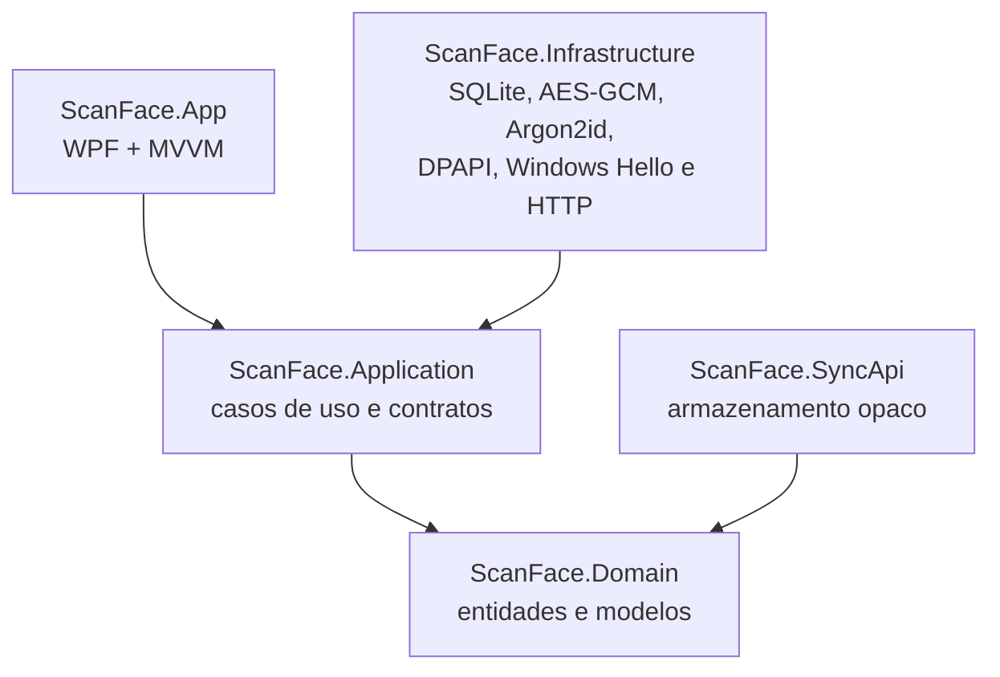

# Arquitetura do ScanFace

## Objetivo

O ScanFace é um cofre de senhas Windows offline first. A aplicação funciona sem servidor e executa toda operação criptográfica no computador do usuário. A sincronização é um adaptador opcional que recebe somente um snapshot já cifrado.

## Clean Architecture simplificada

| Projeto | Responsabilidade | Dependências internas |
|---|---|---|
| `ScanFace.Domain` | Credenciais, pastas, envelopes cifrados, metadados e modelos de sincronização | nenhuma |
| `ScanFace.Application` | Criação, desbloqueio, CRUD de credenciais e pastas, backup, troca de senha, sessão e sincronização | Domain |
| `ScanFace.Infrastructure` | Implementações de criptografia e integrações externas | Application, Domain |
| `ScanFace.App` | Views WPF, ViewModels, comandos e composição | todas as camadas do cliente |
| `ScanFace.SyncApi` | API autenticada e SQLite de blobs opacos | Domain |

O MVVM existe somente na apresentação WPF. Os ViewModels chamam casos de uso e não contêm SQL, Argon2id, AES ou chamadas HTTP.

## Ciclo de vida das chaves

Na criação do cofre:

1. O cliente gera uma chave do cofre de 32 bytes com `RandomNumberGenerator`.
2. Gera um salt aleatório de 16 bytes.
3. Deriva uma chave de 32 bytes da senha mestra com Argon2id: 64 MiB, 3 iterações e paralelismo 4.
4. Protege a chave do cofre com AES-256-GCM e a chave derivada.
5. Se o usuário ativar o Windows Hello, pede consentimento e cria um segundo envelope com DPAPI no escopo `CurrentUser`.
6. Limpa buffers temporários de chaves com `CryptographicOperations.ZeroMemory`.

Cada credencial e cada pasta são serializadas como JSON e cifradas integralmente com AES-256-GCM. O identificador e o tipo do registro fazem parte dos dados autenticados adicionais (AAD), impedindo mover um ciphertext válido para outro identificador ou tipo. A associação entre credencial e pasta fica dentro do JSON cifrado da credencial.

No desbloqueio por senha, o cliente deriva novamente a chave e abre o primeiro envelope. No desbloqueio pelo Hello, o Windows confirma o usuário e o aplicativo abre o envelope DPAPI local. Assim, o rosto autoriza a mesma chave aleatória; o rosto nunca é transformado em chave criptográfica.

## Persistência

O arquivo `%LOCALAPPDATA%\ScanFace\vault.db` contém:

- um documento de metadados com salt, parâmetros Argon2id e envelopes;
- identificador, nonce, ciphertext, tag e data de atualização de cada credencial e pasta.

Nome, usuário, senha, site, notas, favorito, nome da pasta e associação com a pasta ficam dentro dos ciphertexts. O SQLite usa journal WAL e sincronização `FULL`. Ao abrir um cofre criado na série 1.0, a tabela de pastas é adicionada de forma incremental; as credenciais existentes permanecem associadas a “Sem pasta”.

O arquivo `%LOCALAPPDATA%\ScanFace\sync.settings` é protegido por DPAPI e guarda URL, token e marcador de versão da sincronização.

## Backup e sincronização

O backup `.scanface` contém o envelope protegido pela senha mestra, as credenciais cifradas e as pastas cifradas. Backups da série 1.0, que não possuem a coleção de pastas, continuam aceitos. O envelope DPAPI/Hello é removido, pois não funciona em outro perfil ou computador. Por isso, restaurar em uma nova máquina exige a senha mestra do backup; depois da restauração, o usuário pode cadastrar o Hello do novo dispositivo.

A sincronização envia a representação Base64 desse mesmo snapshot. O servidor controla versões de forma otimista: uma atualização só substitui a anterior quando `If-Match` corresponde à versão lida. Se cliente e servidor mudaram desde a última sincronização, o aplicativo sinaliza conflito e não sobrescreve nenhum lado.

## Sessão e bloqueio

A chave do cofre permanece somente na memória durante a sessão desbloqueada. Ao bloquear, encerrar ou atingir cinco minutos sem atividade, o cliente zera o buffer. Senhas copiadas são removidas da área de transferência após 30 segundos se o conteúdo ainda for o mesmo.
